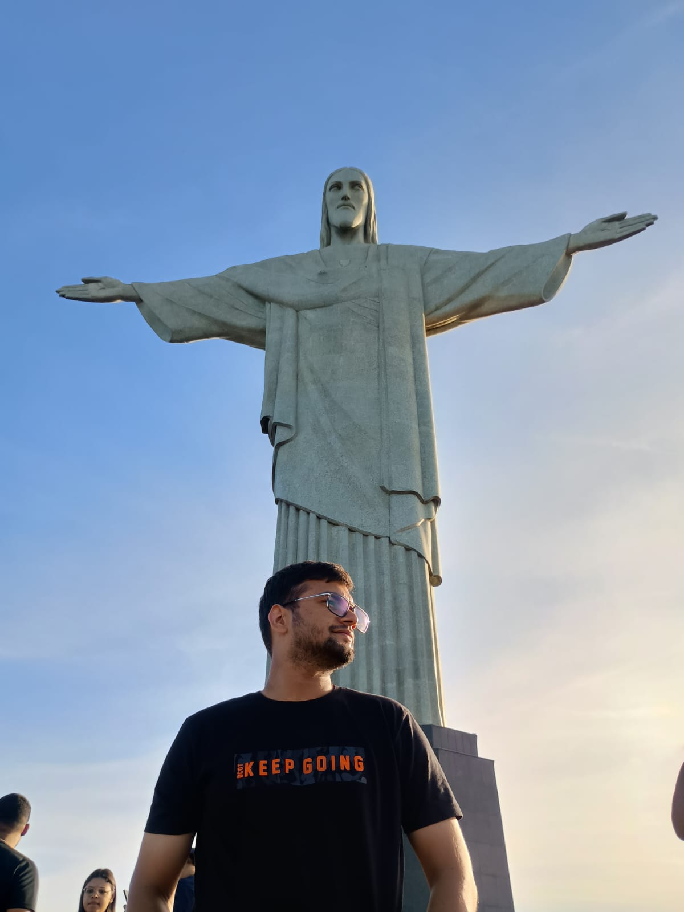

# Parveen Kumar

Research Scholar, IIT Ropar  
Inverse Problems & Partial Differential Equations

## About Me

I am a PhD scholar at IIT Ropar working on **Inverse Problems for Partial Differential Equations (PDEs)**.

## Research Interests

- Inverse Problems
- Partial Differential Equations
- Coefficient Identification Problems

---

## Publications

- Parveen Kumar, Gen Nakamura, Manmohan Vashisth  
  *Reconstruction of time-dependent coefficients in Schrödinger equation* (Preprint)

---

## Conferences & Talks

- AIP 2025, Rio de Janeiro

---

## Workshops

- IIT Mandi (2023)
- IISc Bengaluru (2023)

---

## Contact

📧 PSWAMIFCA@GMAIL.COM
